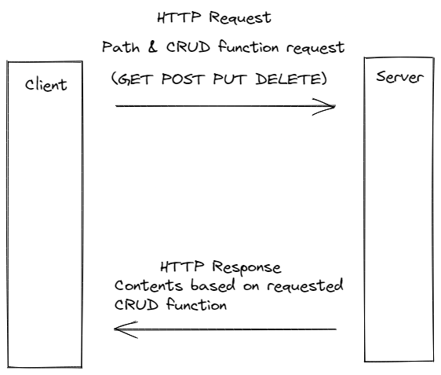

# Project Name

**Author**: Your Name Goes Here
**Version**: 1.0.0 (increment the patch/fix version number if you make more commits past your first submission)

## Overview
<!-- Provide a high level overview of what this application is and why you are building it, beyond the fact that it's an assignment for this class. (i.e. What's your problem domain?) -->

## Getting Started
<!-- What are the steps that a user must take in order to build this app on their own machine and get it running? -->

## Architecture
<!-- Provide a detailed description of the application design. What technologies (languages, libraries, etc) you're using, and any other relevant design information. -->

## Change Log
<!-- Use this area to document the iterative changes made to your application as each feature is successfully implemented. Use time stamps. Here's an example:

01-01-2001 4:59pm - Application now has a fully-functional express server, with a GET route for the location resource. -->

## Credit and Collaborations

[How the Web Works, HTTP Request/Response Cycle, used as reference while drawing request/response diagram](https://backend.turing.edu/module2/lessons/how_the_web_works_http)

[Axios Documentation](https://www.npmjs.com/package/axios#features)

## Time Sheets

### Feature 1

Name of feature: Set up your React repository & API keys

Estimate of time needed to complete: 25 minutes

Start time: 8:20pm

Finish time: 9:20pm

Actual time needed to complete: 60 minutes

### Feature 2

Name of feature: Locations: As a user of City Explorer, I want to enter the name of a location so that I can see the exact latitude and longitude of that location.

Estimate of time needed to complete: 25 minutes

Start time: 9:20pm

Finish time: 11:30pm

Actual time needed to complete: 110 minutes

### Feature 3

Name of feature: Map: As a user, I want to see a map of the city so that I can see the layout of the area I want to explore.

Estimate of time needed to complete: 25 minutes

Start time: 11:30pm

Finish time: ~1:20am

Actual time needed to complete: Hard to define, was an on and off issue but technically 2 hours

### Feature 4

Name of feature: Errors: As a user, I want clear messages if something goes wrong so I know if I need to make any changes or try again in a different manner.

Estimate of time needed to complete: 25 minutes

Start time: 12:30 AM

Finish time: 12:32 AM

Actual time needed to complete: 2 minutes
